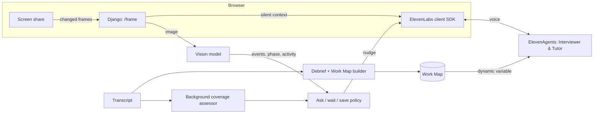

# Sidecar

**Runs alongside your best engineer.**

Sidecar is a voice AI apprentice that learns how a senior engineer deploys software, asks *why* at the right moments, and teaches the next engineer by voice. In DevOps, a sidecar is a helper container that runs next to your app, watches everything it does and adds abilities without getting in the way. Sidecar does the same for people.

Built for the **ElevenLabs × Hack-Nation 7th Global AI Hackathon**, challenge 01: *The AI Apprentice*.

---

## The problem

The people who know how things really run are leaving. Their judgment (why a step happens, what changes a decision, what they would never do) was never written down. Screen recordings capture the clicks, not the reasons. New hires learn the rules by breaking them.

We picked one of the most judgment-heavy desk jobs there is: **putting an app into production**. A senior engineer deploys an app on [Thales Ops](https://thalesops.com), a deployment platform that detects the stack, builds the image, sets up the reverse proxy and HTTPS, health-checks the new version and only then switches traffic. The apprentice learns two things at once: how *this team* deploys, and what Thales Ops does for them that would be manual DevOps work anywhere else.

## How it works

### 1. Capture: Sidecar watches and asks
The expert shares their screen and deploys as usual while **Will**, the Interviewer agent, listens in a side panel.

- Every changed frame goes to a vision model and becomes a short event tagged with the deploy phase: *"Detected Django, Postgres and six required env vars"*, *"Set DEBUG to 0"*.
- Events reach the agent as silent context, so it always knows what is on screen and never asks what the screen already answers.
- It opens by reacting to the first screen, then stays quiet. It asks at natural moments, such as while a build runs or right after a phase change, and never while anyone is talking or typing.
- Its questions come from the gap between generic DevOps (which it knows) and Thales Ops (which it doesn't): *"Normally I'd write an nginx config and get a certificate. Where did that happen here?"*
- **Off the record** pauses everything. Secrets, emails, keys and IPs are redacted before anything is stored.

### 2. Map: debrief, teach-back, Work Map
When the expert clicks **I'm done**, Sidecar lists what it still doesn't understand: exceptions it noticed, rules it is unsure about, cases it hasn't seen. It asks those one at a time, then explains the whole process back until the expert says *"yes, that's how it works."*

The session becomes a **Work Map**, a clickable page with one card per phase:
- steps, each with the expert's reason and their own words as evidence
- **Thales Ops does this for you** vs **by hand, you would**
- the concepts behind each step, in plain language
- decision rules, exceptions, and guardrails marked **STOP** or **WARN**
- a new check scenario to test a new hire

The Work Map also exports as **agent-ready instructions** (`agent.md`): the same steps and guardrails an AI agent can load, so it stops where the expert would.

### 3. Teach: a voice tutor on the new hire's screen
**Alice**, the Tutor agent, loads the Work Map and watches the new hire's screen through the same pipeline.

- She opens by telling them where they are and what to do first.
- At each phase she explains the idea in a sentence or two and what Thales Ops is doing for them.
- When the screen shows a guardrail being broken (for example `DEBUG=1` on a production deploy), she stops them and gives the expert's reason. She respects the expert's exceptions, so the same value on a staging workspace is fine.
- At the end she gives a case they have never seen and grades the session: which guardrails held, which broke, and whether they solved the new case alone.

## Deciding when to speak

The hardest part of being an apprentice is timing. `apprentice/policy.py` is a pure, tested utility function, adapted from a stage controller we built for a voice interview product:

```
value  = coverage gap of the phase (what / why / vs manual / risk) × judgment the action revealed
moment = how good the moment is (waiting on a build > idle > reading > clicking > typing) + phase-change bonus
cost   = cost of interrupting the current activity + share of the question budget already used

ask  if value + moment − cost ≥ threshold, nobody spoke for 2.2 s, and the last question was ≥ 40 s ago
save for the debrief if the topic never gets a good moment
```

A background assessor scores each phase's checklist from the transcript, off the voice path, so the conversation never waits on it. Every decision is logged with its inputs, which is how we tuned the thresholds from real sessions.

## Architecture



## Built with ElevenLabs

| Feature | How we use it |
|---|---|
| **ElevenAgents** | Two agents: the Interviewer (Will) and the Tutor (Alice), created and configured through the API (`manage.py setup_agents`) |
| **Eleven v3 Conversational** | Expressive voices for a curious, patient apprentice and a calm tutor |
| **LLM choice** | Claude Sonnet 5 behind both agents |
| **Scribe Realtime** | Speech recognition, with keywords for deployment vocabulary (Nixpacks, CSRF, Caddy…) |
| **Contextual updates** | Screen events reach the agent silently, without triggering a reply |
| **Dynamic variables** | The Work Map and check scenario are injected into the Tutor per session |
| **Skip turn** | The Interviewer stays silent when the expert talks to someone else |
| **Turn settings** | No re-engagement after silence: long quiet stretches are normal while someone works |

Other parts: Django, an Azure OpenAI vision model for screen understanding and Work Map generation, GSAP and Motion for the interface.

## Run it locally

Requirements: Python 3.12+, an ElevenLabs API key, and an Azure OpenAI deployment that accepts images (Responses API).

```bash
python -m venv .venv
.venv/bin/pip install -r requirements.txt
cp .env.example .env          # add your keys
.venv/bin/python manage.py migrate
.venv/bin/python manage.py setup_agents --tts-model eleven_v3_conversational   # creates both agents, writes their IDs to .env
.venv/bin/python manage.py runserver
```

Open http://localhost:8000 in Chrome. Screen sharing and the microphone need `localhost` or HTTPS. Use headphones so the agent doesn't hear itself.

Tests: `.venv/bin/python manage.py test apprentice`

## Deploy

The app deploys on Thales Ops with the automatic (Nixpacks) build; no Dockerfile is needed. The `Procfile` runs migrations and serves with gunicorn on `$PORT`, and `/healthz` is the health check. Attach a Postgres database to fill `DATABASE_URL`, and set the variables from `.env.example` with `DEBUG=0`. Run a single instance: the coverage assessor runs inside the app process.

## Project layout

```
apprentice/
  policy.py      when to ask: the utility policy (pure, unit-tested)
  prompts.py     agent prompts, vision prompt, debrief / Work Map / grading prompts
  views.py       pages, frame pipeline, background assessor, Work Map export
  elevenlabs.py  agent configuration, signed URLs
  llm.py         vision and JSON calls
  static/        capture, teach and map pages; shared voice, screen and orb engine
docs/deploy_phases.md   deploy phases, coverage checklist, the DevOps primer the apprentice starts from
```

## What's next

Today Sidecar learns one expert, one task and one new hire. The next step is a **living deployment memory**: every engineer's Work Maps in one place, kept current by a Sidecar that only asks about what changed. The same guardrails that teach a new hire can then let Thales Ops agents run routine deploys on their own and stop exactly where a senior engineer would.
